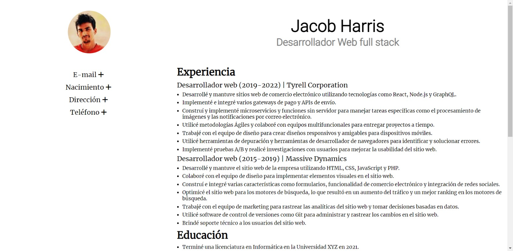
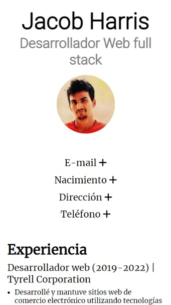

<h1>Proyecto final Ticmas Academy - Curriculum Vitae</h1>

Live demo: <a href="https://lautaroxavier.github.io/ticmas-proyecto-final/">https://lautaroxavier.github.io/ticmas-proyecto-final/</a>

El sitio consiste en una única página. El encabezado contiene el nombre y el título de la profesión además de la foto de perfil. El cuerpo principal contiene los datos personales y 3 secciones detallando la experiencia, estudios y habilidades.

El sitio es full responsive y está diseñado con flexbox.

<h3>Vista de escritorio</h3>

<h3>Vista en dispositivos móviles</h3>

Los datos personales vienen ocultos por defecto, ,se pueden mostrar y volver a ocultar haciendo click en los títulos.

Los datos personales son generados cada vez que se carga la página utilizando la API de <a href="https://randomuser.me/">https://randomuser.me/</a>.

